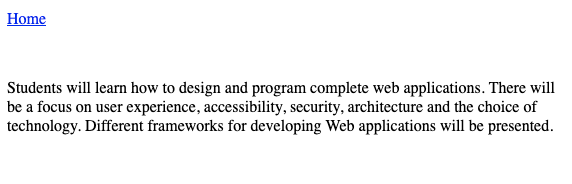

# Lab Exercise: Globalization and Custom tags

For the exercises, you will use the [DAT152i18nWebAppExercise](DAT152i18nWebAppExercise) project. 

Then, import the maven project into your preferred IDE. Add the project to your Apache Tomcat server 10.1.x. Start your tomcat server and point your url to “http://localhost:8080/webapp” (default tomcat server port=8080)

## Task 1 - I18N
Design a 2-page web application that is internationalized and localized to NO and EN.

The page will provide description of DAT152 course and information about exam as shown below.
- Clicking “Course Description” should display page 2
- Clicking “Home” should display page 1

(Hint: Check out the code example [DAT152LibraryClientI18n project](https://github.com/tosdanoye/dat152-lab/tree/main/F24/LibraryClientI18n) and use ideas from the code to solve this task.)

Page 1 - Home

Page 2 - Course Description

## Task 2 - Custom Tags

Write a custom tag to style the course description text as follows and also change the text to uppercase:

The custom tag will have the following attributes that can accept values at runtime or assigned at compiled stage as shown in the box above:
- borderSize: An integer that defines the thickness of the border.
- width: An integer that defines the size of the container.
- borderColor: A string type to pass the color of the border of the container.
- background: A string to pass color for the background.

You are free to use either a tag handler class or a JSP tag file.

